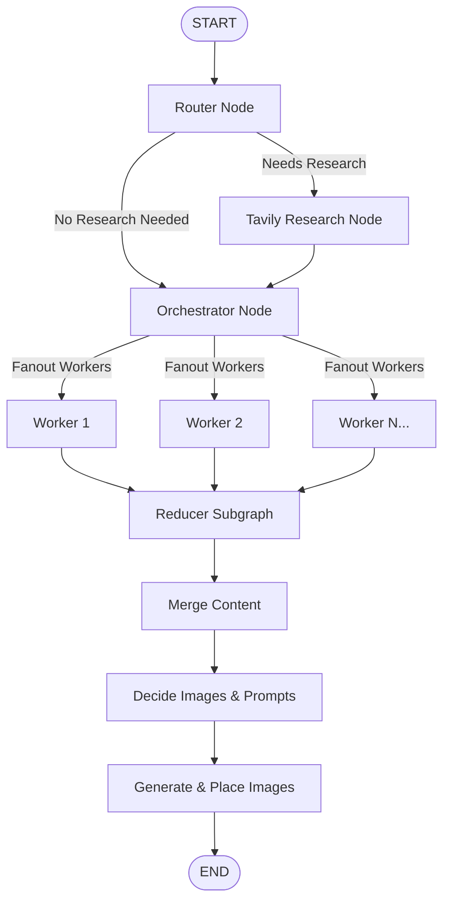

# AI Blog Writing Agent

An autonomous, multi-agent AI system built with **LangGraph**, **LangChain Groq (Llama-3.3-70B)**, **Tavily Search**, and **Google Gemini / Pollinations AI**. 

The agent accepts any technical topic, determines whether real-time web research is required, formulates a structured outline, writes beginner-friendly markdown sections in parallel, plans visual infographics, and generates relevant multimodal images to produce publication-ready technical blog posts.

---

## Features

- **Intelligent Routing**: Automatically categorizes queries into `closed_book` (foundational concepts), `hybrid` (concepts needing fresh tools), or `open_book` (volatile news/updates).
- **Automated Web Research**: Synthesizes and deduplicates real-time web evidence using the **Tavily Search API**.
- **Structured Planning & Parallel Execution**: Uses an Orchestrator agent to create non-overlapping section blueprints and fans out parallel Worker agents via LangGraph `Send` primitives.
- **Multimodal Illustration Generator**: Proposes visual infographic prompts and generates images using **Google Gemini API** (`gemini-2.5-flash-image`) with an automatic fallback to **Pollinations AI** (FLUX model).
- **Markdown & Media Integration**: Merges sections, embeds image markdown links, and outputs formatted `.md` files.

---

## Agent Architecture



---

## Repository Structure

```text
Blog-Writing-Agent/
├── backend/
│   ├── bwa_image.ipynb          # LangGraph AI Blog Agent Jupyter Notebook
│   └── main.py                   # Standalone Python executable agent
├── docs/
│   └── BlogWringAgent_Code.docx  # Architecture & design specifications
├── examples/
│   ├── images/                   # Generated visual assets for sample blogs
│   └── *.md                      # Sample generated technical blogs
├── .env.example                 # Environment variables template
├── .gitignore                    # Security and build exclusion rules
├── README.md                     # Project documentation
└── requirements.txt              # Alphabetically sorted dependencies
```

---

## Quickstart Guide

### 1. Clone the Repository
```bash
git clone https://github.com/your-username/AI-Blog-Writing-Agent.git
cd AI-Blog-Writing-Agent
```

### 2. Set Up Virtual Environment
```bash
# On Windows
python -m venv venv
venv\Scripts\activate

# On macOS/Linux
python3 -m venv venv
source venv/bin/activate
```

### 3. Install Dependencies
```bash
pip install -r requirements.txt
```

### 4. Configure Environment Variables
Copy `.env.example` to `.env` and fill in your API keys:
```bash
cp .env.example .env
```

Edit `.env`:
```env
GROQ_API_KEY=your_groq_api_key
TAVILY_API_KEY=your_tavily_api_key
GOOGLE_API_KEY=your_google_api_key
```

---

## Running the Agent

### Option A: Using the Python Script
Run the backend generator directly from the command line:
```bash
python backend/main.py "Introduction to Prompt Engineering"
```

### Option B: Using the Jupyter Notebook
Open and run `backend/bwa_image.ipynb` in VS Code or Jupyter Lab:
```bash
jupyter notebook backend/bwa_image.ipynb
```

The generated blog post and its visual illustrations will be saved inside the `examples/` directory.

---